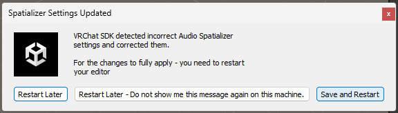
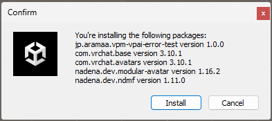
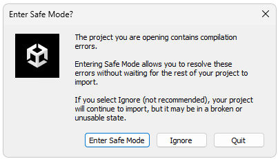
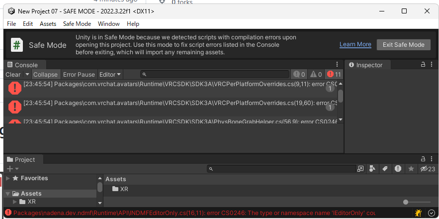
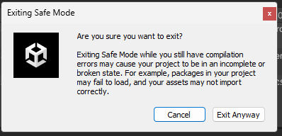
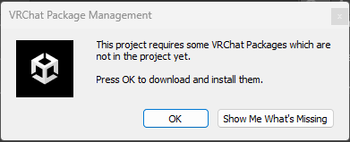

# VPAI導入時における「Spatializer Settings Updated」ダイアログの発生検証報告書



## 1. 検証の概要
VPAI（VPM Package Auto Installer）を使用してパッケージを展開した際に特定の条件下でSpatializer Settings Updatedが出るか検証した。
vpmDependenciesにcom.vrchat.avatarsを追加または依存パッケージ内でcom.vrchat.avatarsを追加する設定をした場合、  
Unityエディタ上で「Spatializer Settings Updated」ダイアログが表示される挙動について、最小構成の環境を作成し、再現性と発生条件を検証した。

---

## 2. 再現環境 (Environment)

### ソフトウェア・パッケージ構成
| 項目 | バージョン / 詳細 |
| :--- | :--- |
| **Unity Editor** | 2022.3.22f1 |
| **VRChat SDK - Base** | 3.10.0 (最新より1マイナーバージョン下を初期設定) |
| **VRChat SDK - Avatars** | 3.10.0 (最新より1マイナーバージョン下を初期設定) |
| **VRChat Package Resolver Tool** | 0.1.29 |
| **VPMPackageAutoInstaller** | 1.1.5 |
| **Modular Avatar** | 1.16.2 |
| **NDMF** | 1.11.0 |

### サーバー側設定 (Remote Config)
検証用に以下のリポジトリおよびパッケージを構成した。  
(作成時のVRChat SDKバージョンは、最新のものに更新させるために3.10.1を指定しています。)

* **VPM Repository:** [vpm-vpai-error-test.json](https://github.com/aramaa-vr/vpm-repos/blob/master/develop/vpm-vpai-error-test.json)
```json
{
	"name": "aramaa.vpm-vpai-error-test",
	"id": "io.github.aramaa.vpm-vpai-error-test",
	"author": "aramaa",
	"url": "https://aramaa-vr.github.io/vpm-repos/develop/vpm-vpai-error-test.json",
	"packages": {
		"jp.aramaa.vpm-vpai-error-test": {
			"versions": {
				"1.0.0": {
					"name": "jp.aramaa.vpm-vpai-error-test",
					"version": "1.0.0",
					"url": "https://github.com/aramaa-vr/vpm-vpai-error-test/releases/download/1.0.0/jp.aramaa.vpm-vpai-error-test-1.0.0.zip?",
					"displayName": "vpm-vpai-error-test",
					"description": "vpm-vpai-error-test",
					"unity": "2022.3",
					"unityRelease": "22f1",
					"documentationUrl": "",
					"changelogUrl": "",
					"licensesUrl": "",
					"license": "Custom",
					"author": {
						"name": "aramaa"
					},
					"vpmRepositories": [
						"https://vpm.nadena.dev/vpm.json"
					],
					"vpmDependencies": {
						"nadena.dev.modular-avatar": ">=1.16.2",
						"com.vrchat.avatars": ">=3.10.1"
					},
					"type": "avatar"
				}
			}
		}
	}
}
```

* **Package ZIP:** [jp.aramaa.vpm-vpai-error-test-1.0.0.zip](https://github.com/aramaa-vr/vpm-vpai-error-test/releases/download/1.0.0/jp.aramaa.vpm-vpai-error-test-1.0.0.zip)
* **Package ZIPに入っている package.json:** [package.json (Raw)](https://raw.githubusercontent.com/aramaa-vr/vpm-vpai-error-test/refs/heads/master/package.json)
```json
{
    "name": "jp.aramaa.vpm-vpai-error-test",
    "version": "1.0.0",
    "url": "https://github.com/aramaa-vr/vpm-vpai-error-test/releases/download/1.0.0/jp.aramaa.vpm-vpai-error-test-1.0.0.zip?",
    "displayName": "vpm-vpai-error-test",
    "description": "vpm-vpai-error-test",
    "unity": "2022.3",
    "unityRelease": "22f1",
    "documentationUrl": "",
    "changelogUrl": "",
    "licensesUrl": "",
    "license": "Custom",
    "author": {
        "name": "aramaa"
    },
    "vpmRepositories": [
        "https://vpm.nadena.dev/vpm.json"
    ],
    "vpmDependencies": {
        "nadena.dev.modular-avatar": ">=1.16.2",
        "com.vrchat.avatars": ">=3.10.1"
    },
    "type": "avatar"
}
```

---

## 3. VPAI 設定内容
[jp.aramaa.vpm-vpai-error-test-1.x.x-installer.unitypackage](jp.aramaa.vpm-vpai-error-test-1.x.x-installer.unitypackage)
検証パッケージに含まれる `com.anatawa12.vpm-package-auto-installer/config.json` の内容は以下の通り。

```json
{
    "vpmDependencies": {
        "jp.aramaa.vpm-vpai-error-test": "1.x.x"
    },
    "vpmRepositories": [
        "https://aramaa-vr.github.io/vpm-repos/develop/vpm-vpai-error-test.json",
        "https://vpm.nadena.dev/vpm.json"
    ]
}

```

---

## 4. 検証手順と結果

### 検証手順

1. Unity 2022.3.22f1 にて新規プロジェクトを作成。
2. あえて旧バージョンの VRChat SDK (3.10.0) を事前にインストールし、バージョン更新が走る余地を作る。
3. 作成した VPAI パッケージをプロジェクトにインポートし、展開を開始。

### 検証結果

VPAIによるパッケージ展開（および依存関係の解決）の過程で、以下のダイアログが発生することを確認した。 
4回中/4回発生した。  

> **Spatializer Settings Updated**  
> *VRChat SDK detected incorrect Audio Spatializer  
>  settings and corrected them.  
> For the changes to fully apply - you need to restart  
> your editor.*

エラーから復旧までの流れ
「Import」  
  
「Install」  
  
「ok」  
  
「Save and Restart」  
  
「Enter Safe Mode」  
  
「Exit Safe Mode」  
  
「Exit Anyway」  
  
「OK」  
  

リポジトリの参照がリストに出なくなる。
ただ、プロジェクト自体は通常道理に動作している様子でした。  

---

## 5. 結論と考察（改訂）

本検証では、VPAI（VPM Package Auto Installer）によるパッケージ導入と依存関係の解決（VRChat SDK の導入／更新が発生し得る状態）を行った際に、Unity エディタ上で「Spatializer Settings Updated」ダイアログが表示されることを確認した。

このダイアログは文面上、VRChat SDK が Audio Spatializer に関する設定を検知・補正した可能性を示唆しているが、どのパッケージ／どの処理が直接ダイアログを表示したか、および ProjectSettings（Audio Settings）が実際にどう変更されたか は本資料の範囲では確認できていない。したがって、原因を「Audio Settings の Spatializer Plugin が未設定（デフォルト）であることを SDK が検知し自動修正したため」と断定はできない。

少なくとも VPAI は依存関係の解決・導入を進める役割であり、本事象はその過程で VRChat SDK がロード／更新されるタイミングに関連して発生していると考えられる。よって現時点では、VPAI固有の不具合と断定する根拠は不足しており、必要に応じて Editor.log や Audio Settings の導入前後差分を取得して、発生主体と変更内容を追加で確認するのが妥当である。
