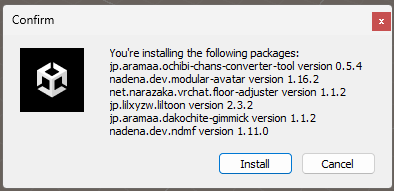

# unitypackage 導入ガイド（最短版）

> 対象: `jp.aramaa.何か-x.x.x-installer.unitypackage` を導入する方
>
> **このページは「手順だけ」を短くまとめています。上から順に実施してください。**

## まず結論（ここだけ読めば開始できる）

1. **先に SDK 更新**（`VRChat SDK - Avatars` / `Base`）
2. その後に **unitypackage を Import → Install**
3. 最後に **VCC で `aramaa` リポジトリを有効化**

`VRChat SDK - Avatars` の警告が出たら、いったん `Cancel` して **1 に戻る**。

---

## 手順

### 1. VRChat SDK を更新（必須）

1. VCC で対象プロジェクトの `Manage Project` を開く
2. `VRChat SDK - Avatars` を最新化
3. `VRChat SDK - Base` を最新化
4. `Open Project` で Unity を開く

**完了条件**
- `Avatars` が最新
- `Base` が最新

---

### 2. unitypackage を導入

1. `jp.aramaa.何か-x.x.x-installer.unitypackage` をダブルクリック
2. 1つ目のダイアログで `Import`
3. 2つ目のダイアログで `Install`

#### 分岐（重要）

`VRChat SDK - Avatars` が表示された場合:
- `Cancel` を押す
- 手順 1（SDK 更新）を完了してから再実行

---

### 3. VCC でアップデート可能化

1. VCC を再起動
2. `Settings → Packages → Installed Repositories` で `aramaa` にチェック
3. `Projects → (対象プロジェクト) → Manage Project → Selected Repos → Multiple Repositories → aramaa` にチェック

---

## エラー時のみ実施（`Spatializer Settings Updated`）

1. `RestartLater` をクリック
2. Unity を閉じる（保存して終了）
3. VCC で対象プロジェクトの `Manage Project` を開く
4. `Resolve` をクリック
5. `VRChat SDK - Avatars` を最新化
6. `VRChat SDK - Base` を最新化
7. 必要に応じて VPAI を再導入
8. Unity を再起動し、Console エラー消失を確認

---

## まだ直らない場合

1. SDK を一度 `Remove` して再インストール
2. `Library` フォルダを削除して Unity 再起動
3. `Packages/manifest.json` の依存関係を確認

---

## 最終チェック

- [ ] `VRChat SDK - Avatars` が最新
- [ ] `VRChat SDK - Base` が最新
- [ ] unitypackage の `Import` / `Install` が完了
- [ ] Unity Console のエラーが解消

---

## 注意

- 「VCC 推奨」商品は、可能なら VCC 導入を優先してください
- 本手順は既知ケース向けで、すべての環境での解決を保証するものではありません
